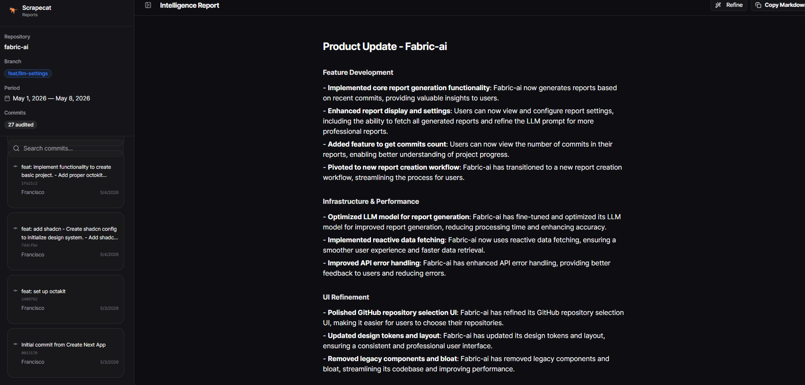
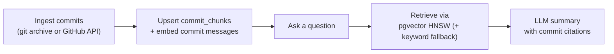

<p align="center">
  
</p>

<br>

## 🐈 Scrapecat — RAG Chat Over Git History

Scrapecat is an engineering intelligence assistant that answers questions about your repository's history. It uses RAG (Retrieval-Augmented Generation) to find the most relevant commits and summarize them at a feature level — no more digging through git logs. Built because a CEO kept asking what engineering was doing **daily** when everything was on Git.

## Tech Stack
- **Backend:** Fastify 5 (Node.js), Drizzle ORM + PostgreSQL (pgvector)
- **Frontend:** Next.js 16 (React 19), TanStack React Query, Tailwind CSS v4, shadcn/ui + AI Elements
- **Data Source:** Native GitHub REST via `Octokit`, local git archive for commit ingestion
- **Intelligence:** OpenRouter API (Google Gemma, DeepSeek, GPT-4o, etc.) or Ollama (local LLMs)
- **Package Manager:** pnpm workspaces

## Core Features

- **RAG Chat:** Ask questions about your code history in natural language. The system retrieves the most relevant commits via vector search (pgvector HNSW index) and summarizes them with an LLM.
- **Feature-Level Summaries:** Related commits are grouped by feature, bug fix, refactor, or infrastructure — no individual commit listing unless asked.
- **Source Citations:** Every AI response includes a collapsible "Sources Used" section with direct links to GitHub commits.
- **Project Tree Sidebar:** Connected repositories with nested chat sessions, branch selector, and navigation.
- **Model Selection:** Pick the chat model per conversation; configure the embedding model in Settings.

## Future Roadmap
- **External Integrations:** Connect Slack, Linear, Jira, and Notion so summaries cross-reference commits with tickets, messages, and docs.
- **Git Adapters:** Pluggable adapters for any git source — GitLab, BitBucket, self-hosted instances, and beyond.
- **Persona-Driven Synthesis:** Custom tone mapping tailored for CTOs, Founders, or Board Members.
- **Enterprise-Grade Security:** E2E Encryption, SSO, and Organization-level RBAC.

AI is increasing commit velocity, not reducing it. Scrapecat is the missing layer that translates engineering output into something every department can actually understand.

## How it works



Ingestion is batch/archive-based (see [`docs/architecture.md`](./docs/architecture.md)); retrieval runs against Postgres as the read model.

## Demo Mode (public concept demo)

Scrapecat ships a serverless-first **demo profile** used for the public, hosted
concept demo (targeting Cloudflare Workers). It reads public repos over the
GitHub REST API — no git binary or disk — serves every read from PostgreSQL, and
locks visitors to a pre-ingested repository set. It is opt-in via env vars and
does not change the self-hosted product. See [`docs/demo.md`](./docs/demo.md).

## Getting Started

### 1. GitHub API Configuration

Scrapecat requires a Personal Access Token (PAT) to fetch repository metadata and commit history.

- 1.  Navigate to [GitHub Settings](https://github.com/settings) > Developer Settings > Personal Access Tokens.
- 2.  Ensure the `repo` (Full control of private repositories) and `read:org` scopes are enabled.
- 3. Scrapecat treats your data as read-only. We analyze metadata to answer questions without ever modifying your source code.

### 2. OpenRouter Intelligence Layer

We use OpenRouter's API for LLM access. The free tier works out of the box.

- 1. Sign up at [OpenRouter](https://openrouter.ai/keys) and create a free API key.
- 2. Default chat model is set by `AI_MODEL` (default `mimo-v2.6-flash`); override anytime in the Settings UI or per conversation.

### 3. Ollama (Local Alternative)

Ollama runs LLMs locally — no API key, no cloud, no data leaves your machine.

**Setup:**

1. Install Ollama from [ollama.com](https://ollama.com/download)
2. Pull the required models:
   ```bash
   ollama pull llama3.2:1b    # Chat model (1.3GB, 1.2B params)
   ollama pull nomic-embed-text  # Embedding model (274MB)
   ```
3. Verify Ollama is running: `curl http://localhost:11434/api/tags`
4. In the **Settings UI** (`/settings`):
   - Set the **chat model** provider to `Ollama (Local)` → select `llama3.2:1b`
   - Set **Embedding Provider** to `Ollama (Local)` → select `nomic-embed-text`
5. The API key field can be set to `ollama` (placeholder, no real key needed)

**Available models are fetched automatically** from your local Ollama instance — only installed models appear in the dropdown.

> **Docker users:** When running in Docker, the backend connects to Ollama via `host.docker.internal`. If Ollama is running on your host machine, no extra config is needed.

## Environment Setup

```bash
cp backend/.env.example backend/.env
```

At minimum, set `OPENROUTER_API_KEY` (LLM access — free key at
[openrouter.ai/keys](https://openrouter.ai/keys)) and, for self-hosted,
`GITHUB_TOKEN` (repository access — [github.com/settings/tokens](https://github.com/settings/tokens)).

For the full list of backend and frontend variables, their defaults, and
copy-paste demo/self-hosted configurations, see
[`docs/environment.md`](./docs/environment.md).

> **Using Ollama?** No additional env vars needed — just ensure Ollama is running locally and select it in the Settings UI.

## Local Deployment

```bash
# Install dependencies
pnpm install

# Generate database migration
pnpm run db:generate

# Apply migrations (creates projects, commit_chunks, chat_sessions, credentials tables)
pnpm run db:migrate

# Start the development server
pnpm run dev
```

The application will be live at http://localhost:3000. Connect your first repository and start asking questions about your code history.

## Docker Setup

### Prerequisites
- [Docker](https://docs.docker.com/get-docker/) and [Docker Compose](https://docs.docker.com/compose/install/)

### Development (hot reload)

```bash
docker compose up --build
```

Three services start:
- **Postgres (pgvector)** at http://localhost:5432 — persisted via a named volume
- **Backend** (Fastify) at http://localhost:4000 — auto-reloads via `tsx watch`
- **Frontend** (Next.js) at http://localhost:3000 — HMR via `next dev`

### Stop

```bash
docker compose down
```

## Architecture

### RAG Pipeline

1. **Query parsing** — natural language date windows are parsed ("last 30 days", "since June", "2024") and applied as metadata filters
2. **Vector search** — candidate commits retrieved via the pgvector HNSW index (`MAX_COSINE_DISTANCE = 0.8`)
3. **Keyword fallback** — text match when embeddings are missing or the vector query fails
4. **LLM summarization** — system prompt instructs the LLM to group by feature, not list individual commits
5. **Sources** — every response includes a collapsible "Sources Used" section with commit links

## Contributing

We welcome contributions from engineers who understand that documentation is as important as code.

- **Bug Reports:** Open an issue with a clear reproduction script and environment details.
- **Feature Requests:** Focused on scalability, retrieval accuracy, and developer autonomy.

## License

This project is licensed under the MIT License.

---

Scrapecat | Built for the builders.
_Engineered by Francisco Luna_
