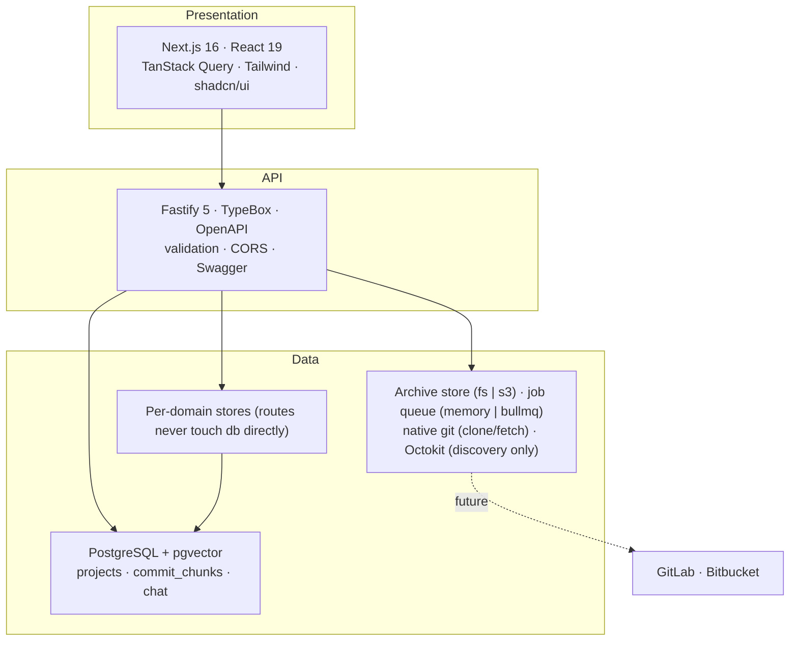
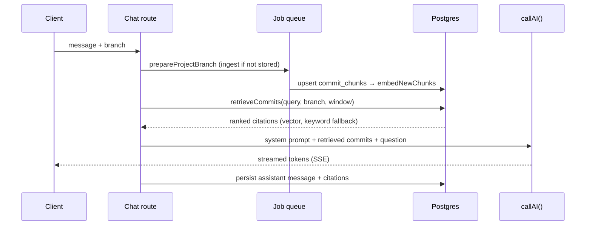
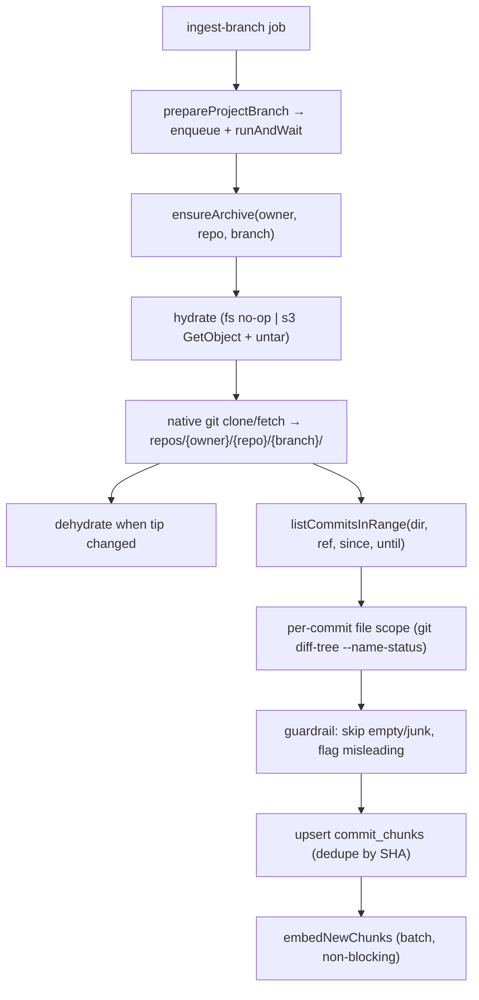

# Architecture

Scrapecat is a RAG chat over a repository's git history. Commits are ingested into
Postgres (the read model), embedded, and retrieved by semantic + keyword search
to ground an LLM answer.

## Tiers

## RAG pipeline

`POST /api/v1/chat/sessions/:id/messages` ingests the branch if needed, then
retrieves, then streams the answer.

- **Vector search** is the primary path (`cosineDistance` over the HNSW index,
  ceiling `MAX_COSINE_DISTANCE = 0.8`); **keyword search** is the fallback when
  embeddings are missing or the vector query fails. Retrieval limit: `20`.
- **Date windows** ("last 30 days", "since June") are parsed into metadata
  filters; temporal keywords with no explicit date anchor on the latest commit.
- **Grounding** is the commit message plus file scope — see [`embeddings.md`](embeddings.md).

## Commit ingestion

Batched and archive-based, run as a deduped job. Callers enqueue `ingest-branch`
and await it: with `QUEUE_DRIVER=memory` (default) it runs inline; with `bullmq` a
Worker in the same process drains Redis.

- **Why batch:** the workload needs everything from a rate-limited API; one clone
  collapses it into a single idempotent fetch. GitHub REST is used only for
  **discovery** (repo/branch listing, connection check) and the clone itself.
- **Dedupe by SHA:** re-running a window writes nothing new; already-synced
  commits are skipped before file-scope work.
- **Failure handling:** the only remote step is clone/fetch (retryable).
  Embeddings are a separate, non-blocking step and never fail ingestion.

### Why native git (not a JS git library)

`src/repositories/git.ts` shells out to the system `git` binary with `execFile`,
baked into the image (`backend/Dockerfile.dev`). Do **not** replace it with
`isomorphic-git`, `nodegit`, etc.:

- **Off-loop, bounded memory** — a separate C process keeps pack/delta work off
  the V8 heap, which is what makes an in-process Worker safe and large clones
  non-OOMing.
- **Protocol maturity** — shallow/single-branch clone, incremental fetch,
  packfiles, `http.extraheader` auth, fast `log`/`diff-tree` on huge repos.
- **Reproducibility** — pinning git gives identical behavior across dev,
  replicas, and prod.
- **Statelessness** — git touches only disposable job scratch, matching "nothing
  durable on the image."

Serverless cannot run the binary at all — which is why the demo uses the GitHub
REST API. The clean split: self-hosted ships git; serverless does not and uses
the API path.

## Model resolution

Two roles, each with a provider + model setting stored in `app_settings`:

| Role | Setting | Default |
|---|---|---|
| Chat (RAG answer) | `chatProvider` / `chatModel` | `openrouter` / `env.AI_MODEL` |
| Embeddings | `embeddingProvider` / `embeddingModel` | `openrouter` / `env.EMBEDDING_MODEL` |

Precedence: a per-conversation override (chat only) → stored `app_settings` row →
`defaultAISettings()` (env defaults). All LLM calls go through `callAI()` in
`src/chat/ai.ts`; embeddings through `embedTexts()` in `src/projects/embeddings.ts`.

## Tech debt

Every shortcut below is intentional and tracked, not accidental.

### Git provider coupling

External data flows through `src/shared/integrations/git-provider/` (an Octokit
adapter behind an interface), but it is imported directly by consuming
routes/services with no DI — adding GitLab/Bitbucket means touching each call
site.

### Database coupling

The DB client is initialized at module load in `src/db/client.ts`. Access goes
through per-domain stores; routes never import `db` directly.

### No dependency injection

Services are imported at the top of files, not injected. Swapping implementations
means changing import paths everywhere; tests compensate with `vi.mock()`.

### No auth layer

The API has zero authentication — fine for trusted self-hosted deployments,
impossible to open as multi-tenant SaaS without a rework.

### Validation & data-integrity gaps

- `startDate`/`endDate` are unvalidated strings; invalid dates surface as 500s.
- `limit`/`per_page` on discovery endpoints are validated (1–100) and fail fast.
- No transactions: project upsert and chunk ingest are separate writes. A mid-way
  failure leaves chunks persisted (safe today — chunks are the cache).

### Diff grounding is file-level, not content-level

The prompt is grounded on provable diff **scope** (files, line counts, commit
link); the commit message is a hint, flagged when it contradicts the diff. The
chat model never reads patch hunks, and the embedding corpus is the commit
message by design (this is commit/PR review, not code review). Revisit only if
message-based retrieval proves insufficient — the `embed:backfill` script already
handles one-time re-embedding.

## What needs to happen

Decouple in phases, no big-bang rewrites:

1. **Git provider interface** — one adapter interface so routes don't know the
   source (GitHub/GitLab/Bitbucket).
2. **Data access layer** — per-domain stores (already largely in place); vector
   search infrastructure is ready.
3. **Dependency injection** — wire providers and stores via Fastify's `decorate`
   so routes receive dependencies instead of importing them.

Each migration: extract interface → implement behind it → run both in parallel →
flip the default → remove the old one.
