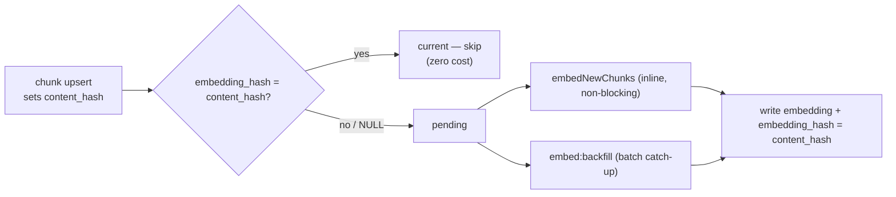

# Embeddings

How commit embeddings are produced, stored, and kept cheap. Semantic search over
these vectors backs RAG retrieval.

## Why this approach

1. **Cost.** Embedding full diffs burns tokens on patch noise (boilerplate,
   formatting, generated files) for little retrieval value. The corpus is the
   **commit message** — commit/PR review, not code review.
2. **Reliability.** Embedding must never block or fail chat retrieval. If the
   provider is down or out of quota, the keyword fallback still answers; vectors
   are a derived cache that catches up later.
3. **Correctness by construction.** A commit is immutable (identified by SHA), so
   stored content never changes — only its embedding can go stale, and that
   staleness is tracked explicitly.

## The corpus: the commit message

Each `commit_chunks` row stores the commit message (the embedding source) plus
metadata:

| Field | Source | Stored in |
|---|---|---|
| `sha` | local git log (native git) | `commit_sha` |
| `commit_message` | local git log | `commit_message` (embedding source) |
| `author` | local git log | `author` |
| `files_changed` | `git diff-tree --name-status` vs parent | `metadata` jsonb |
| `validation.status` (`confirmed`/`flagged`/`skipped`) + `notes` | rule guardrail | `metadata` jsonb |

No diff content is read at any point.

## Staleness gate: `content_hash` / `embedding_hash`

Two SHA-256 columns make embedding idempotent and incremental:

- `content_hash` — hash of the stored `commit_message`; set on every upsert.
- `embedding_hash` — hash of the content the current `embedding` represents;
  `NULL` = never embedded.

A row's embedding is **current** iff `embedding_hash = content_hash`. The job only
processes rows where that is false, so re-running over stored commits embeds
**nothing**, and a changed row re-embeds exactly once.

## Provider and dimensions

- **Provider:** OpenRouter's OpenAI-compatible embeddings endpoint, reusing the
  OpenRouter key (`resolveApiKey("openrouter")` → `OPENROUTER_API_KEY`).
- **Model:** the `embeddingModel` setting, defaulting to
  `openai/text-embedding-3-small` (env `EMBEDDING_MODEL` fallback).
- **Dimensions:** **768** — matches the `vector(768)` column and the HNSW index
  (`commit_embedding_hnsw_idx`, cosine). `EMBEDDING_DIMENSIONS = 768` in
  `src/projects/embeddings.ts`.
- **Allowlist:** only `text-embedding-3-small` and `text-embedding-3-large` are
  exposed; both are requested at 768 dims.
- **Guarding:** a wrong-length vector fails the batch loudly instead of writing
  corrupt data.
- **Model changes** apply only to newly embedded rows; existing vectors keep
  their model until a full re-embed (the gate is content-based, not model-based).

## When embeddings happen

1. **Inline, non-blocking** — after ingestion upserts new chunks,
   `embedNewChunks(projectId)` runs fire-and-forget (`void ... .catch(...)`).
   Retrieval never waits on it. On failure (no key, quota, outage) chunks stay
   persisted with `content_hash`; the next run or backfill catches up.
2. **Batch backfill** — `pnpm embed:backfill` (`backend/scripts/embed-backfill.ts`)
   walks every project and embeds pending rows in batches (`EMBEDDING_BATCH_SIZE`,
   default 100) — one HTTP call per batch.

## Reliability & scaling

- **Bounded cost per run:** only SHAs not already stored are embedded
  (`getChunksByShas` skips existing) — same-range re-runs are free.
- **Graceful degradation:** embedding failures leave rows pending; ingestion never
  fails because of the embed step.
- **Resumable:** every step is idempotent and safe to re-run (dedupe by SHA).

## Status

- **Shipped:** archive-cloned file scopes, message-based corpus, staleness gate,
  inline non-blocking embed, batch backfill, OpenRouter provider wiring, `vector(768)`.
- **Not shipped (future):** RAG prompt enrichment and any retrieval consumer
  beyond the current chat path.
